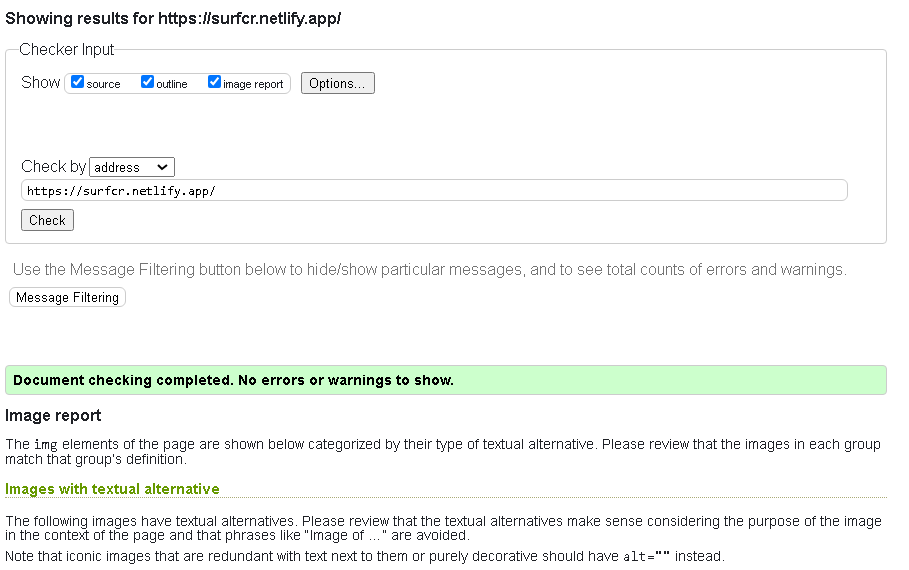
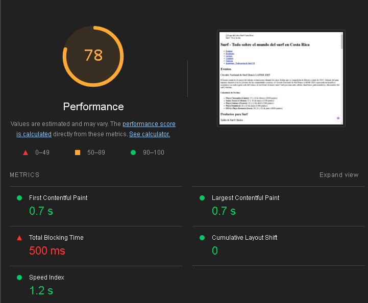
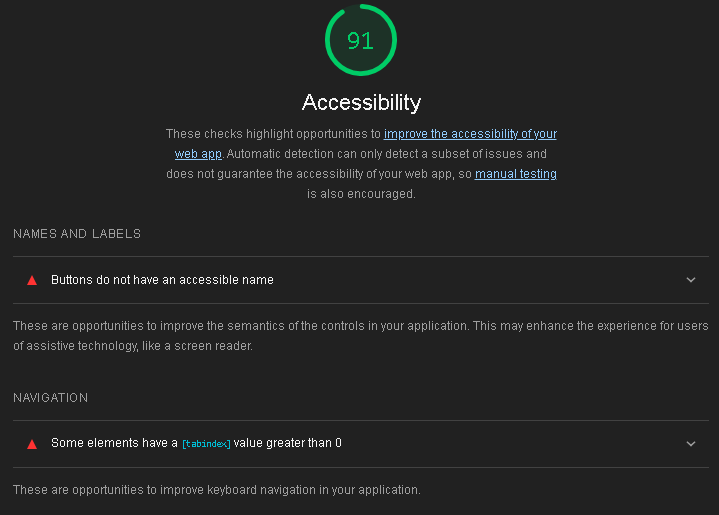
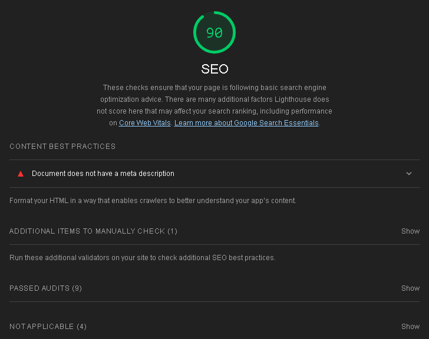

#  Surf Costa Rica
 La página  SurfCR busca darle a los surfistas locales toda la información que necesitan para su pasión: Productos, Noticias, Eventos, Lugares para Surfing, etc.

## Estructura Semántica:

Se utilizaron las siguientes etiquetas semánticas:

* header: Para definir la cabecera de la página, tiene el logo, el título y un navbar.

* nav: Es un bloque en el header con enlaces de navegación para la página, funciona para los lectores de pantalla asi pueden acceder a las secciones de interés más rápido.

* main: Tiene el contenido principal de la página.

* section: Cada uno es usado para agrupar contenido semánticamente relacionado.

* article: Se utilizó para los productos, noticias, eventos, etc. Sirve para representar contenido independiente de otros.

* aside: Para contenido secundario y útil para tener a mano, usado para barra lateral en el formulario de contacto para las redes sociales.

* footer: Es el pie de la pagina, tiene el copyright y una frase para la página. Se utilizó tambien en algunos articles que tenían estructuras divididas.

## Url de Netlify:

https://surfcr.netlify.app/

## Validación W3C:

No hay warnings ni errores de estructura, únicamente se menciona sobre los textos descriptivos en las imagenes y poner vacíos en imagenes decorativas pero todas las imagenes de la página son necesarias para el lector. Luego de eso no hay ningún problema.

## Lighthouse:

### Rendimiento:

El rendimiento está bien en general, el único problema es el TBT (Total Blocking Time), pero esto en local no ocurre, es debido al hosting gratuito en Netlify (muy posiblemente).

### Accesibilidad:

La accesibilidad no es 100 debido a nombres en el botón del formulario el cual se llama Enviar, no existen otros botones, ese mismo botón tiene un aria-label que lo describe. También menciona el tabindex="-1" el cual es tomado como no accesible, sin embargo ese atributo no es necesario en la imagen en la que está entonces, tomando en cuenta esto, no hay nada que mejorar según lighthouse puesto a que el atributo fue puesto intencionalmente y el botón es para enviar el formulario, no tiene otra función. Además tiene aria-label para lector de pantalla y al ser un formulario es intuitiva la función del botón para usuarios convencionales.

### SEO:

Se menciona que la página no posee metadatos de descrición, lo cual es cierto. Se agregará en el siguiente despliegue.

## Accesibilidad Aplicada:

* tabindex: Se utilizó para probar el control de tabulación de elementos para navegación por teclado. Valor "0" para que sea accesible mediante tabulación normal y "-1" para no ser accesible por tabulación normal.

* aria-label: Agrega una etiqueta para lectores de pantalla cuando el texto no es visible o no exista. Esto es importante para que los usuarios de lectores de pantalla sepan que función cumple un botón por ejemplo.

* aria-labelledby: Esto asocia un elemento a otro para que sirva como etiqueta, por ejemplo un lector de pantalla puede leer "correo electrónico" si se accede al input de email.